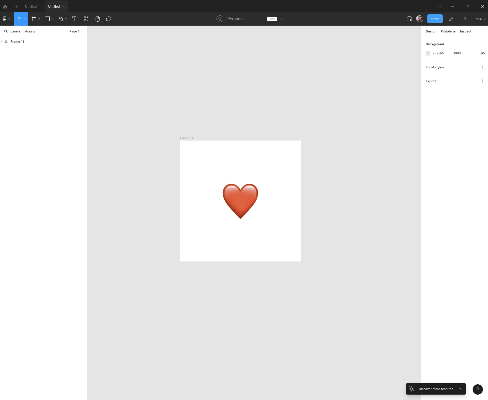
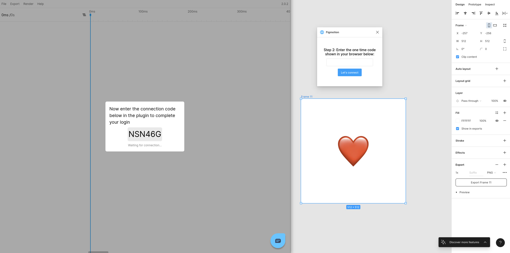
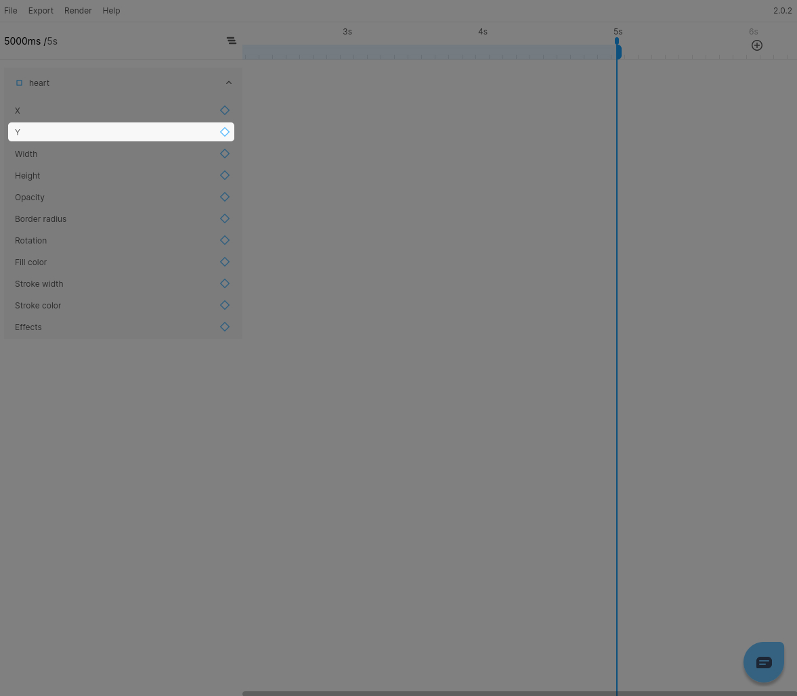
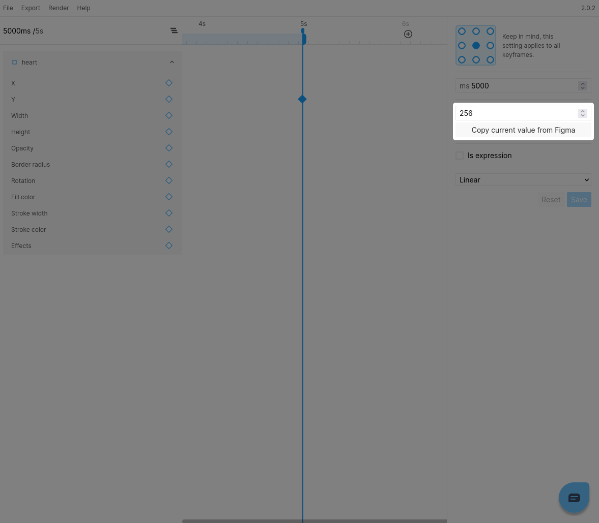
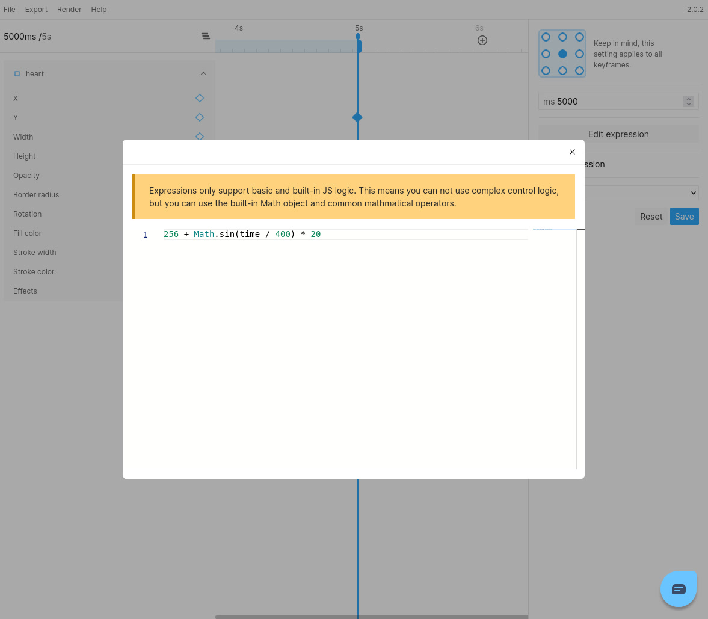

With the introduction of expressions in Figmotion ([Advanced animations with expressions](/docs/animating/advanced-animations-with-expressions)) it has now become super easy to create repetitive (yet complex) animations.

In this small guide we will be creating a floating heart animation with just a single expression keyframe.

## Step 1: Create the Frame
The design is very simple. We simply create a `Frame` and place an image in the middle of it. For this guide, I will be using an image representation of the heart emoji.

## Step 2: Open and connect Figmotion
Let's open Figmotion and connect the standalone UI so we can start animating. 

## Step 3: Add a Y position keyframe
We will be creating a 5s animation, so let's zoom out and move our timehandle to the end of the default timeline at 5s. Next we can expand the image layer to display the available properties to animate. To add our keyframe we wil click the `Add keyframe` button next to the `Y` property.

## Step 4: Change the keyframe to an expression
You can now select the keyframe we just created. Before you enable the `Is expression` checkbox, note down the current value of the `Y` position, we will need this to define the start position in our expression.

Once noted down, you can check the `Is expression` checkbox and subsequently click `Edit expression`. You will now see the expression editor and we can start writing our expression.

## Step 5: Writing the actual expression
We want our heart to softly float up and down to create our animation. We can utilize a sine wave to easily and quickly create this behavior.

  

With this knowledge in mind we can create an expression like this:
`{Y_START_VALUE} + Math.sin(time / {DAMPENING_VALUE}) * {OSCILLATION_AMOUNT}`

This won't work yet because we need to actually enter our parameters.
- `Y_START_VALUE` will be the value we noted down earlier.
- `DAMPENING_VALUE` is a number of your choosing to dampen the speed at which the iamge will oscillate. We will be using `400` in our example.
- `OSCILLATION_AMOUNT` is the amount you want the image to actually move in either direction. We will be using `20` in our example.

The final expression will look like this
`256 + Math.sin(time / 400) * 20`

## That's it!
And that's it, our basic animation is now done:

This is just a basic example and expressions can do so much more. We are definitely excited to see this powerful feature become part of your work and feel free to Tweet us your animations [@figmotionapp](https://twitter.com/figmotionapp).  