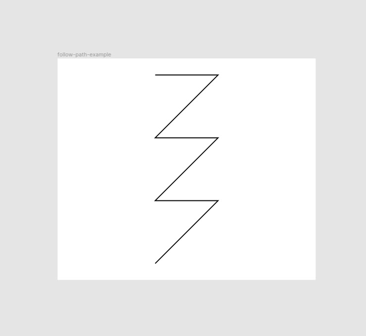
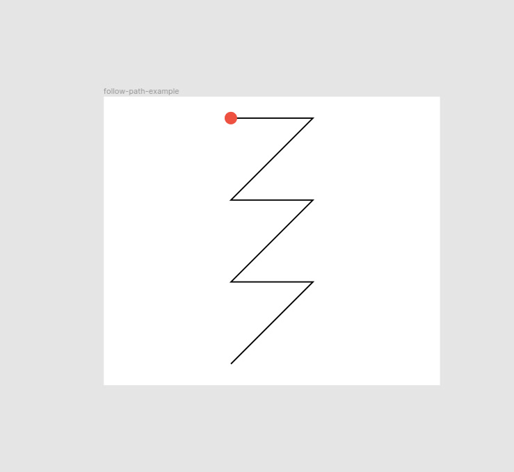
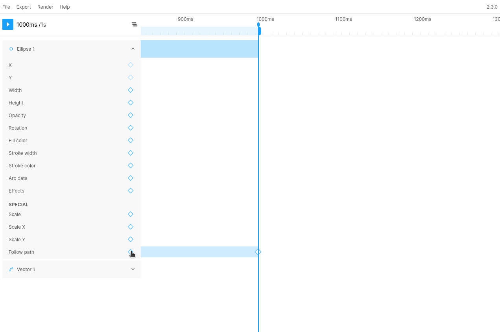
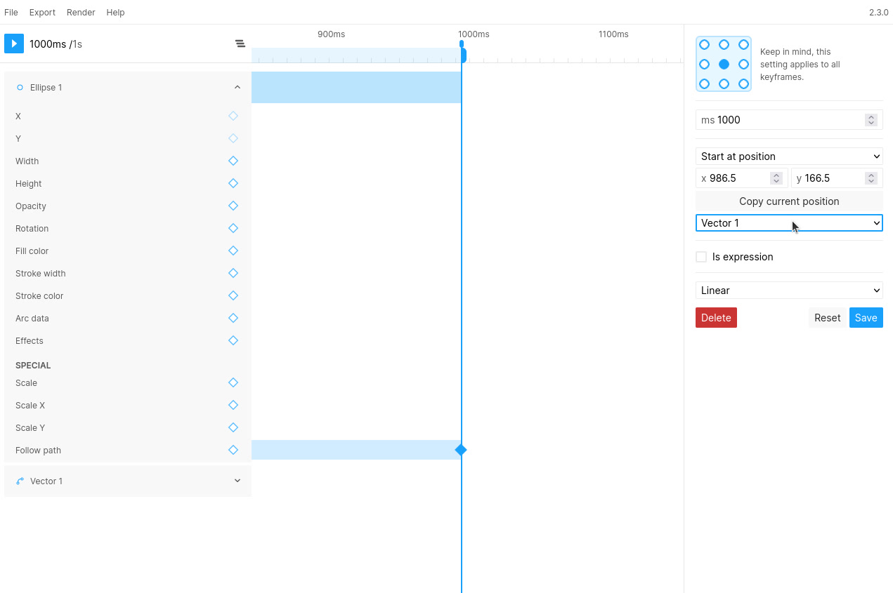
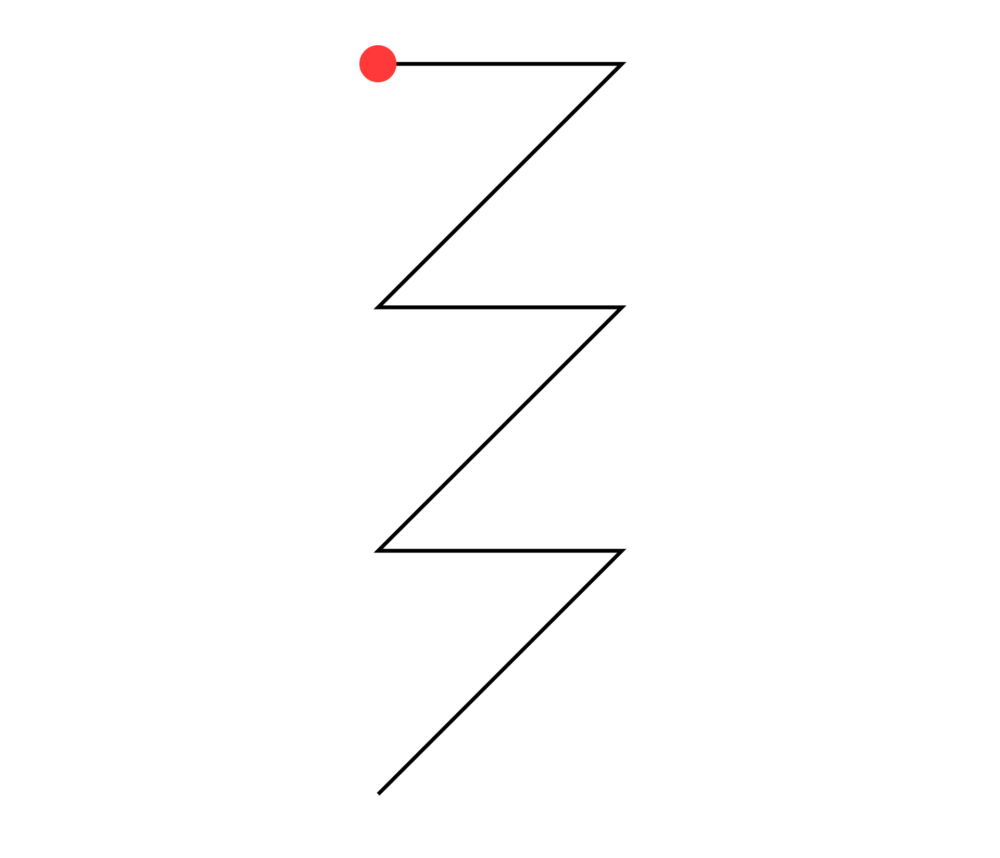

With Figmotion Standalone `2.3.0` it is now possible to create complex movements using the `Follow path` property. This short guide will explain how to use it.

## Step 1: Setup the frame
We will start by defining the path we want our layer to follow. For this example we will just be creating a zig-zag pattern.

  

We will also create the layer we want to animate. This will just be a small red dot for our example.

  

## Step 2: Add the follow path property
Next we will open Figmotion and add a keyframe for our follow path property. We will add the keyframe at the `1000ms` mark to make the animation 1s long.

  

Figmotion won't know which path to follow yet so we will have to open the keyframe panel, by selecting the newly added keyframe, and select the vector layer we want to follow in the dropdown.

> **Note** At this time, only Vector layers can be targeted with the follow path property  

  

Once selected we can hit `Save`  

If we play the animation now, we will see our layer following the path nicely 🎉  

  

## (Optional) Step 3: Hiding the path and changing the positioning
Of course we don't want our reference path to just be visible in the final design, so we can go ahead and simply hide it. This will not impact our animation in any way.

Lastly, we may want our layer to follow the same path, but start in a different location. This is where the "Start at position" setting comes in. This defines the start position of your follow keyframe. To change this you can simply move your layer to the desired starting position and hit "Copy current position" or you can manually update the coordinates. (keep in mind these coordinates are relative to the anchor point whereas the coordinates shown within Figma are always based on the top-left position). This way we can have our layer start in the top left of our frame instead:  

  

You can also change this setting to "End at position" which reverses the behavior so your layer will now end at your pre-defined position as opposed to starting there.