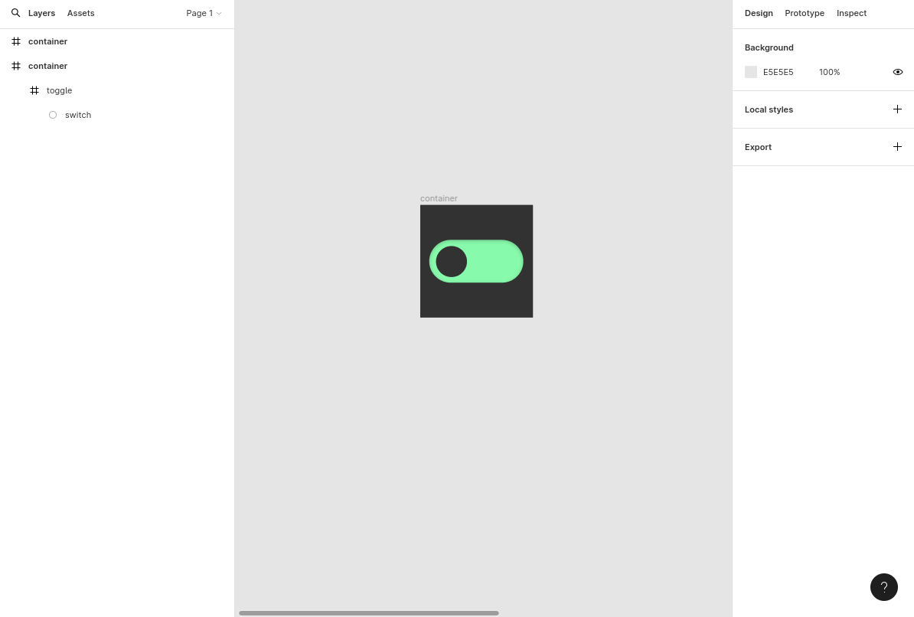
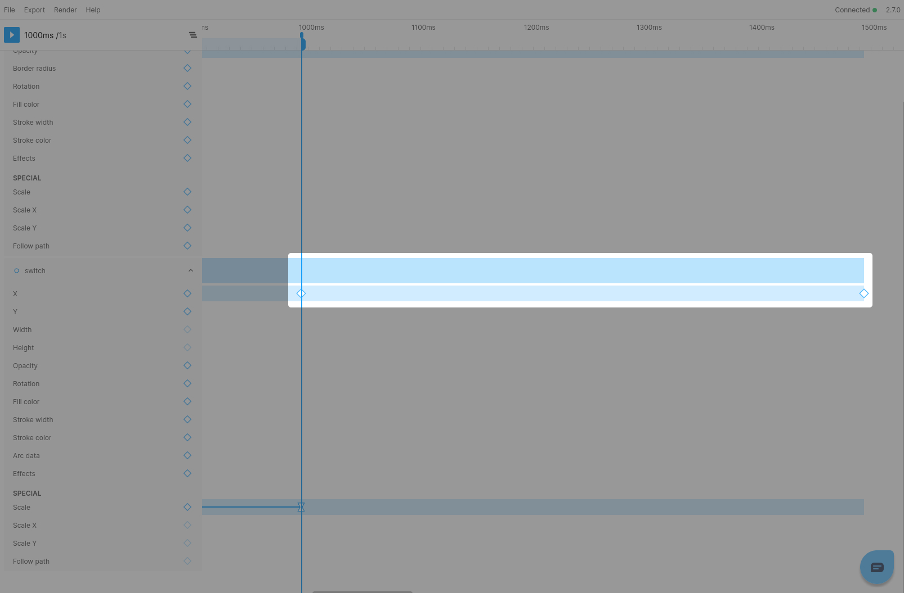

## Creating the animation
### Step 1: Set-up the design
To begin, we'll establish our design. In this case, I've arranged the file for you, which is available for [download here](./img/2023-02-17-from-figmotion-to-react/01-figmotion-switch-example.fig). After downloading, you can import the file into Figma and you will see something like this:  



### Step 2: Open Figmotion
With our design file ready, we can launch Figmotion.


### Step 3: Animate the toggle frame
We will start by fading in the green toggle frame.To accomplish this, we will position our handle at `500ms` and select the `"Add keyframe"` button for the `"Opacity"` property.


By doing this, a keyframe will be inserted at `500ms`, and a starting keyframe will be added at `0ms` to establish our initial value, both of which will be set to 1. We can now proceed with adding our animation.

To begin, we will select the keyframe at `500ms` and adjust the easing value to `"Ease-out."`.
Don't forget to press the `Save` button to update the keyframe.


Moving forward, select the keyframe that establishes our initial value at `0ms` and modify the value to 0.
Once again, don't forget to press `Save` before closing the keyframe panel.


Once these steps are finished, the toggle will fade in as the animation plays.


### Step 4: Scaling in the switch
Moving forward, let's animate the switch. However, you may notice that the switch layer isn't visible in Figmotion's layer panel. There are two methods to access the switch layer:

1. Your first option is to select the "Scope to layer" button besides the `toggle` layer. This will set the scope to the `toggle` layer and display it's children  


2. Another approach is to use the `CTRL/CMD+P` shortcut to open the quick launcher. From there, you can input `switch` and press enter or select the switch layer to access it. This will set Figmotion's scope to the switch layer's parent.


**Note** You can also use the quick launcher to reset the Figmotion scope back to the root of your frame.

Regardless of which method you choose, you will now see a view similar to this:  


To start our animation, we will begin by scaling in the switch. This requires setting a keyframe for the `Scale` property at `500ms`. The switch animation will begin only after the toggle has completely appeared. Therefore, the keyframe at `500ms` will act as our initial value.  


As you can see, the keyframe's value is currently set to 1.
However, since we intend for the switch to start out hidden, we'll need to choose the `500ms` keyframe and adjust its value to `0`.
Furthermore, we must also modify the value of the `0ms` keyframe to `0`.

**Note** You'll also observe an extra field labeled "Initial size" in the keyframe inspector. This value controls the element's size when it's fully scaled in. While it's automatically populated, you can modify it as required.


Afterward, we'll insert another keyframe at 1000ms, which will cause the switch to be completely scaled in.
Please note that scale keyframes are always established as `1` by default.
Therefore, we don't need to adjust the keyframe's value. However, we will modify the easing to `Ease-out`.


When you play the animation now, you'll realize that it stops at `500ms`.
This happens due to our animation's [Out point](https://docs.figmotion.app/docs/getting-started/using-in-out-points). which was set automatically to the time of the initial keyframe we added.
To address this and cover the complete animation up until this point, you have two options. You can either drag the Out point to the desired time, or you can use the `CTRL/CMD+M` shortcut to reset it to the end of the animation.

**Note** Although it may appear unusual, the notion of In and Out points can be quite advantageous. They allow you to examine different sections of your animation by playing or rendering specific parts.

With this all done, you will now see the following animation:


### Step 5: Turning it on
To complete our switch animation, we will now animate it from left to right, indicating that the switch has been turned on.
However, we only want this to happen after the switch has fully appeared. Therefore, we will begin by adding a keyframe at 1000ms for the x property, which will serve as our initial value.
After that, we will add another keyframe at 1500ms for the x property, which is when we want our animation to be complete.

**Note** since we are once again extending our animation, we will reset our out-point by hitting `CTRL/CMD+M`



Now let's select our final keyfame and update it's value. We can enter the value manually, but to make this easier we can simply move the switch in Figma and hit the "Copy current value from Figma" button.
This will simply copy the value from your Figma design and insert it into the keyframe editor.

Lastly we will also update the easing curve. For this final keyframe, we will set the easing to custom and adjust the curve manually.


Once we hit `Save`, we will see our final animation:


## Adding the animation to our React code

### Step 1: Export the animation
To integrate the animation we just created into React we will export the animation for [framer-motion](https://www.framer.com/motion/).
Simply select the `Export` menu item and export and save the `motion.tsx` file to your device. ("Framer Motion" should be selected by default in the export dialog, but you may need to select the option manually)


### Step 2: Set-up our code
The actual design of the switch will need to implemented manually. I have already set-this up in a Codesandbox which you can use as a starting point

<iframe
  src="https://codesandbox.io/embed/01-figmotion-switch-example-starter-hp7x98?fontsize=14&hidenavigation=1&theme=dark"
  style={{ width: '100%', height: '500px', border: '0px', borderRadius: '4px', overflow: 'hidden' }}
  title="01-figmotion-switch-example-starter"
  allow="accelerometer; ambient-light-sensor; camera; encrypted-media; geolocation; gyroscope; hid; microphone; midi; payment; usb; vr; xr-spatial-tracking"
  sandbox="allow-forms allow-modals allow-popups allow-presentation allow-same-origin allow-scripts"
></iframe>

### Step 3: Add the animations
Now comes to exciting part, adding the animations we just exported.
To do this, we will create a file named `motion.ts` in our `src` directory and copy the `animations` variable that we exported from the motion.tsx file.

The final result will resemble something like this.
```tsx
import { TargetAndTransition } from "framer-motion";

export const animations: Record<string, TargetAndTransition> = {
  _1_3_toggle: {
    opacity: [0, 1],
    transition: {
      opacity: {
        type: "keyframes",
        ease: [0, 0, 0.58, 1],
        times: [0, 1],
        duration: 0.5
      }
    }
  },
  _1_4_switch: {
    scale: [0, 0, 1],
    transition: {
      scale: {
        type: "keyframes",
        ease: [
          [0, 0, 1, 1],
          [0, 0, 0.58, 1]
        ],
        times: [0, 0.5, 1],
        duration: 1
      },
      x: {
        type: "keyframes",
        ease: [
          [0, 0, 1, 1],
          [0.174, 0.482, 0.427, 0.949]
        ],
        times: [0, 0.6666666666666666, 1],
        duration: 1.5
      }
    },
    x: [null, 0, 88]
  }
};
```

You will observe that the animations object has two keys, with each key corresponding to one of our Figma layers.
Each key includes all the keyframe and timing information necessary for our animation. Now, all we have to do is connect the keyframes to our elements.

To complete our animation, we will navigate to the App.tsx file.
Here, we will import the `motion.ts` file and then apply the corresponding animation keyframes to each `motion.div` element.

The resulting file will resemble something like this:
```tsx
import "./styles.css";
import { motion } from "framer-motion";
import { createUseStyles } from "react-jss";
import { animations } from "./motion";

const useStyles = createUseStyles({
  // ...existing styles
});

export default function App() {
  const styles = useStyles();

  return (
    <div className={styles.container}>
      <motion.div animate={animations._1_3_toggle} className={styles.toggle}>
        <motion.div
          animate={animations._1_4_switch}
          className={styles.switch}
        />
      </motion.div>
    </div>
  );
}
```

You can also check out the final result in the CodeSandbox below
<iframe
  src="https://codesandbox.io/embed/01-figmotion-switch-example-starter-final-g2o94l?fontsize=14&hidenavigation=1&theme=dark"
  style={{ width: '100%', height: '500px', border: '0px', borderRadius: '4px', overflow: 'hidden' }}
  title="01-figmotion-switch-example-starter-final"
  allow="accelerometer; ambient-light-sensor; camera; encrypted-media; geolocation; gyroscope; hid; microphone; midi; payment; usb; vr; xr-spatial-tracking"
  sandbox="allow-forms allow-modals allow-popups allow-presentation allow-same-origin allow-scripts"
></iframe>