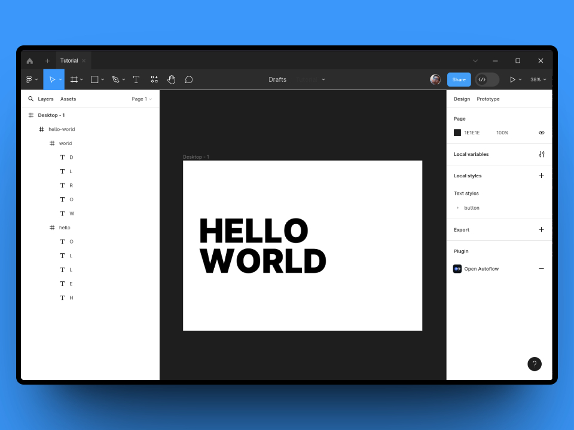
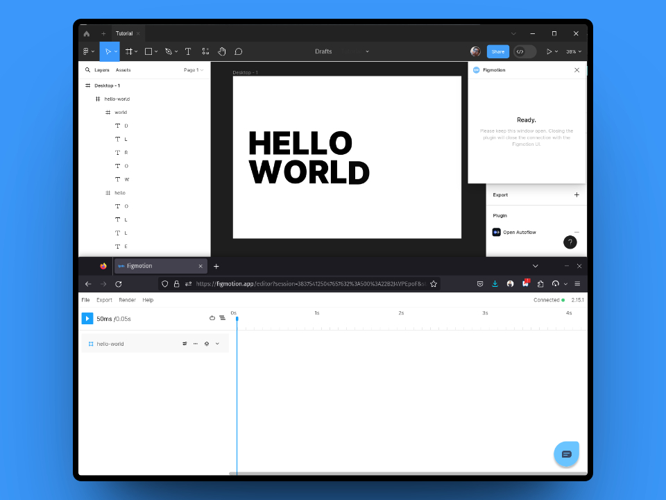
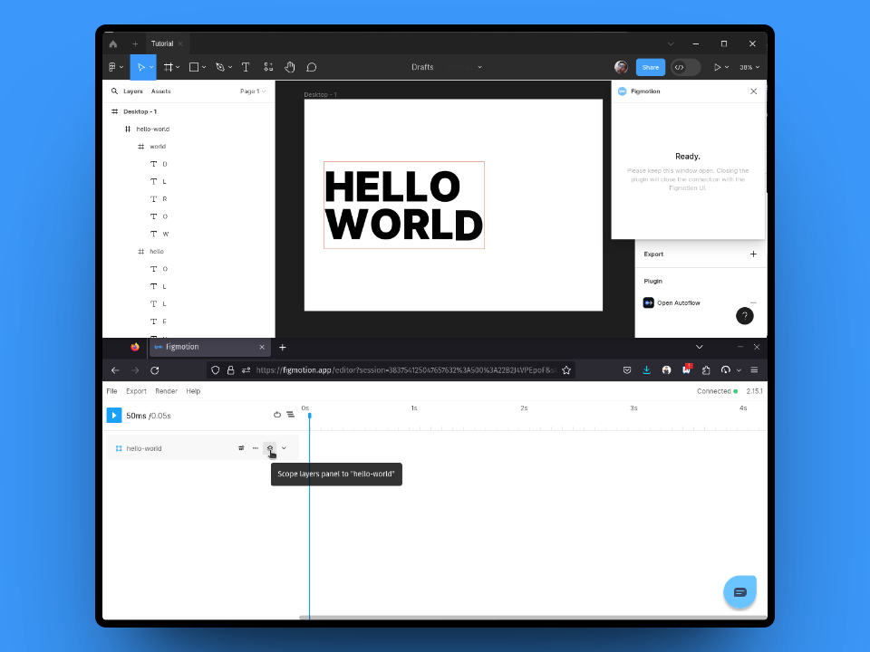
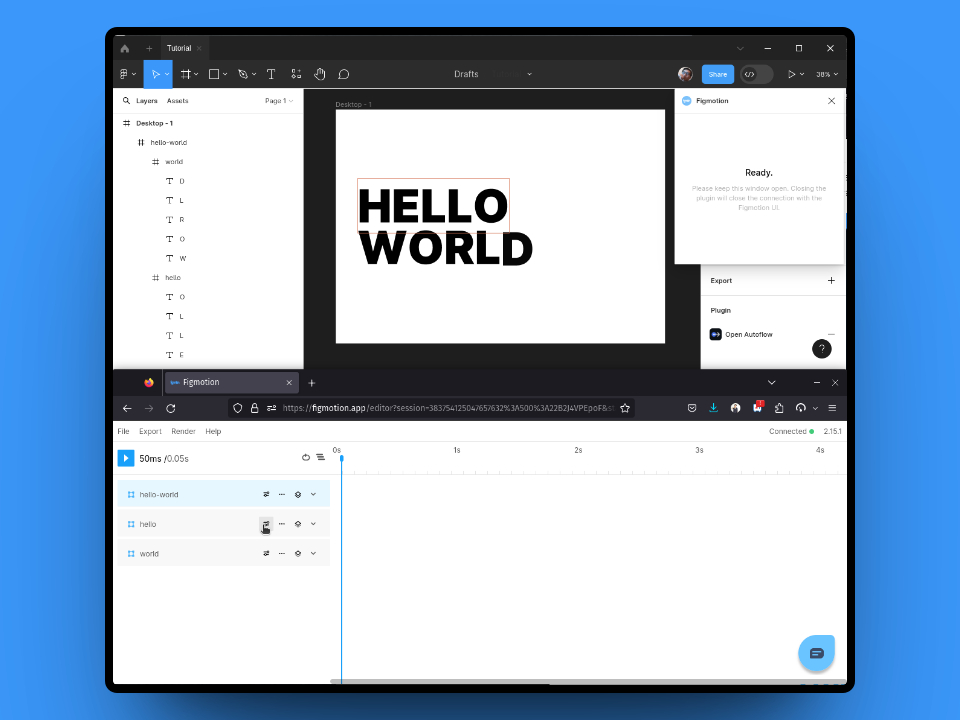
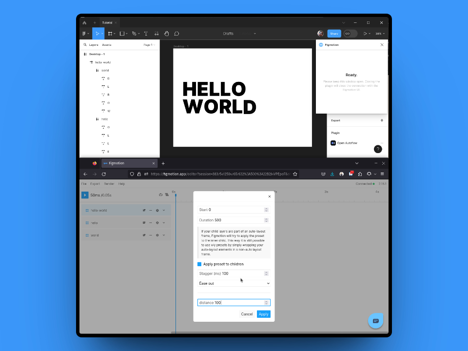
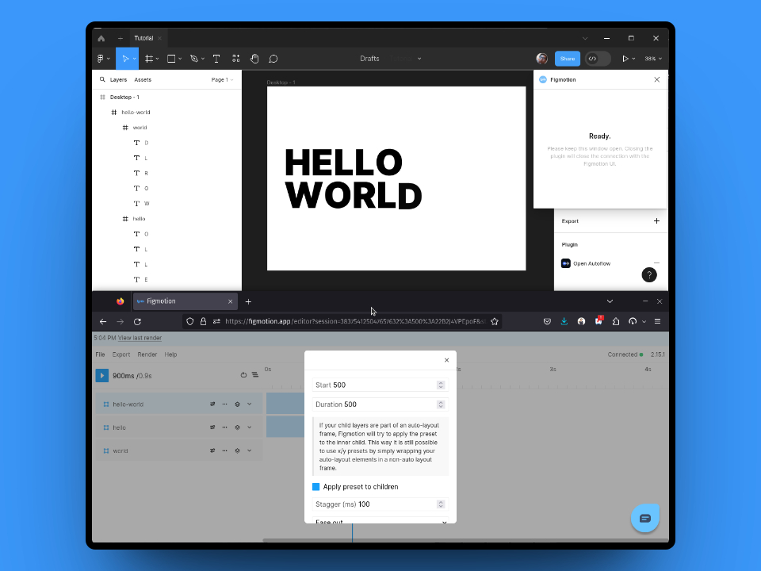

In this mini tutorial we will learn how to create a staggered title animation. The final result will look something like this:
<video loop muted autoPlay style={{ display: 'block', width: '100%', height: 'auto' }}>
  <source src="/videos/2023-09-08-mini-tutorial-staggered-title/final-result.webm" type="video/webm" />
</video>

## Set up design file

To start out we will need to set-up our design file. For this animation we will need to create a separate element for each letter so it can be animated individually. Additionally we will need to make sure the order of the layers is correct for the stagger to apply correctly. This means the words need to be spelled out from the bottom layer to the top.

In the end your layers will look something like this:

## Let's animate!

Once our Frame has been set-up, we can open up Figmotion. You can do this by selectin `Figmotion` from your plugins menu and logging in to the newly opened timeline window. The timeline window is separate from your Figma editor but it will still be connected to your design. This means you can simply place them side by side (or below one another).

Once completed, you will see something like this (in this case the timeline was placed below the Figma editor)

In the example file the layers we need to target are inside the `hello-world` layer. To access the child layers we can select the "Scope layers panel" button. This will scope the layers panel, to the selected frame and display it's children. (you can click the same button to "unscope" the layer)

Now we have access to the "hello" and "world" frames, each of which contains their respective letter. Let's start by applying a preset to the "hello" frame.

Let's select the "Fade in up" preset and configure it with the following settings:

| Setting  | Value | Explanation                                      |
| -------- | ----- | ------------------------------------------------ |
| Start    | 0     | The preset will start at `0ms`                   |
| Duration | 500   | This is the duration of each element's animation (in ms) |
| Apply preset to children | ✅ | Configures the preset to be applied to it's children |
| Stagger | 100 | The delay between each child (in ms) |
| Distance | 100 | This is the distance to fade up |

After applying this staggered preset, you can play the animation and you will see the first word animate in as expected.

<video loop muted autoPlay style={{ display: 'block', width: '100%', height: 'auto' }}>
  <source src="/videos/2023-09-08-mini-tutorial-staggered-title/intermediate-result.webm" type="video/webm" />
</video>

To complete the animation we will apply the same preset to the "world" frame, but we will delay the start of the animation by `500ms`.

### That's it!
That's it, it really is that easy. You can now see the full animation by pressing play and you can render it out to share.

<video loop muted autoPlay style={{ display: 'block', width: '100%', height: 'auto' }}>
  <source src="/videos/2023-09-08-mini-tutorial-staggered-title/final-result-in-player.webm" type="video/webm" />
</video>

### Some variations
You can always play around with the presets and the configuration, here are some more examples of the same design with different presets:

#### Opposite sides (vertical)
<video muted controls style={{ display: 'block', width: '100%', height: 'auto' }}>
  <source src="/videos/2023-09-08-mini-tutorial-staggered-title/variation-1.webm" type="video/webm" />
</video>

#### From left
<video muted controls style={{ display: 'block', width: '100%', height: 'auto' }}>
  <source src="/videos/2023-09-08-mini-tutorial-staggered-title/variation-2.webm" type="video/webm" />
</video>
