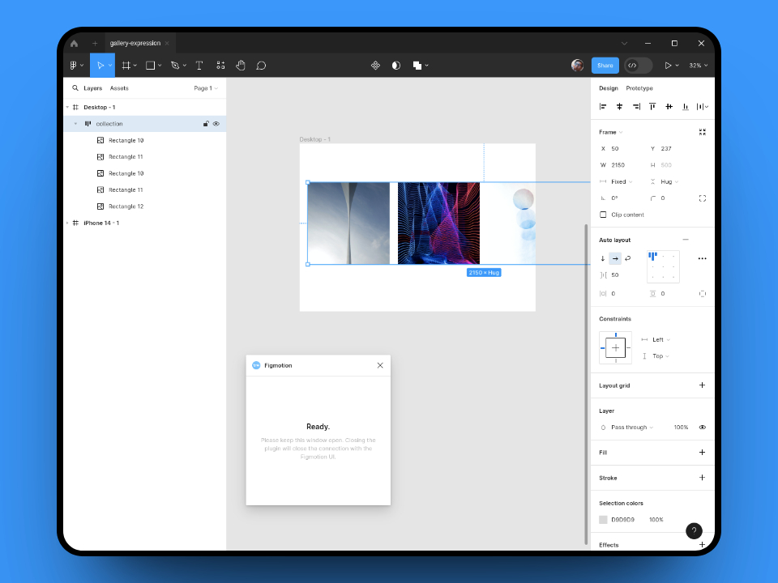
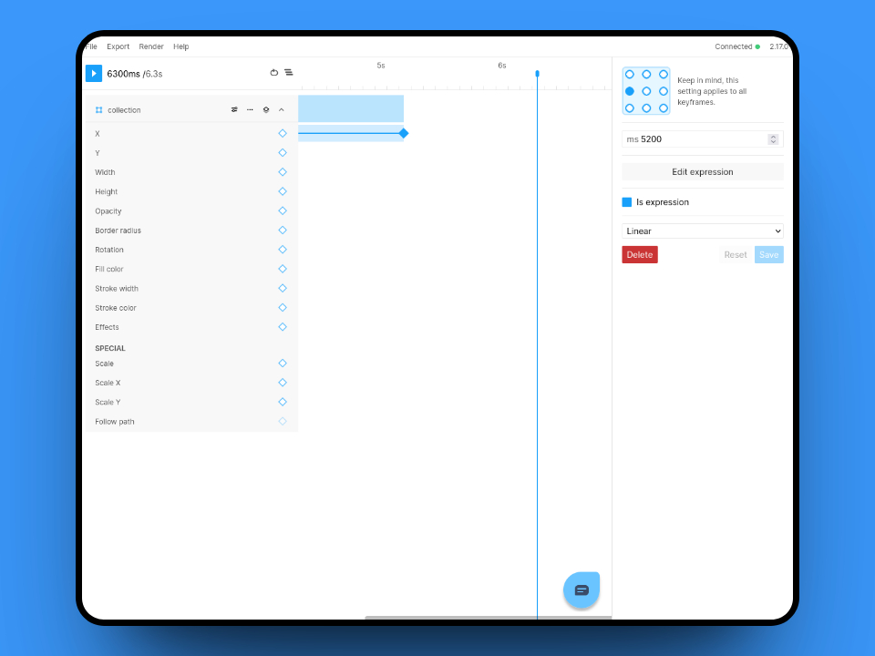

### The question
Recently, I was asked about tips on how to create a sliding gallery animation. Of course you can simply do this by setting keyframes at set intervals and sliding the frame over by a set amount adding wait times in between each image sliding.

I got thinking however and I thought "you can probably do this using an expression" and so I came up with an expression to do this automatically!
Let's dive into it.

### The solution
As always, we will start by setting up the design. Our set-up will be very simple.
We start with a desktop viewport `Frame` and add another `Frame` which will hold our images.
Each image will be `500px` wide and we can enable auto-layout on the collection frame, setting the spacing to `50px`.
You will end up with something like this:  



Next we will figure out the parameters of our expression:  
1. How long should each image be paused for? Let's take `1000ms` for this example.
2. How long should the transition between image be? We will use `300ms`.
3. What's the distance the frame needs to move, to show the next image? In our example, the images are `500px` wide and have a spacing of `50px` between each image.
4. How far from the side will the Frame (which holds the images) start? In our example, there is a `50px` spacing on the left side.
5. How many images are we animating? In our case we will go through 4 images. (this is one less than all the images, so we will end on the last image)

Using these values, we can figure out where our x property expression keyframe needs to go.
The total time for each image is `1300ms` (the sum of the wait time and the transition time), which means our keyframe will be set at `5200`.
**Note: you will need to extend the timeline by clicking the `+` at the `6s` mark**

Next we can edit the keyframe and enable the `Is expression` flag.
We will also change the anchor point to the left side, this is because we want the collection frame to be aligned on the left side.  

  

Now are ready to enter the expression, so go ahead and click `Edit expression`.

We will be using the expression format below:
```
(SPACING_LEFT+Math.floor(time/TOTAL_TIME_PER_IMAGE)*(-IMAGE_MOVE_DISTANCE))
    +(Math.max(((time % TOTAL_TIME_PER_IMAGE) - WAIT_TIME_PER_IMAGE), 0))/TRANSITION_TIME_PER_IMAGE * -IMAGE_MOVE_DISTANCE
```

With our final expression looking like this:
```
(50+Math.floor(time/1300)*(-550))
    +(Math.max(((time % 1300) - 1000), 0))/300 * -550
```

Great! That's it! You will now have a sliding image gallery using just a single keyframe.
Of course, the expression can be updated to any number of images and any size.

<video loop muted autoPlay style={{ display: 'block', width: '100%', height: 'auto' }}>
  <source src="/videos/2023-09-12-automatic-gallery-expression/final-result.webm" type="video/webm" />
</video>
