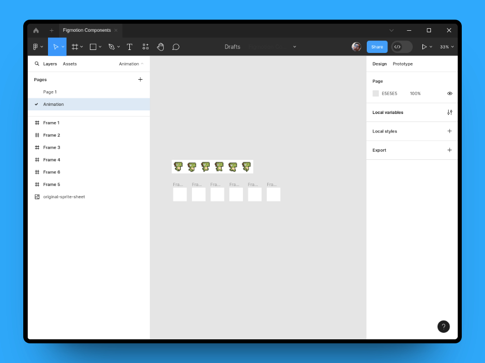

## Introduction

Recently, we introduced the option to animate component properties. You may be confused as to why this can be useful, since switching between properties and variants happens immediately without any transition. Well, there is one big use case for this: Sprite animations!

In this guide we will create a short looping sprite aninmation using the component variants.

## Setting up the components
For this tutorial, we will be using the walking sprite sheet from the following [ADA Fruit Tutorial](https://learn.adafruit.com/makecode-arcade-pixel-animation/sprite-animation-fundamentals).  

We'll start by downloading the image and placing it in Figma.

  

We can see the sheet is `640px` wide, `107px` high and contains 6 states.  We can divide the width by the 6 states (`106.67px` each) and create 6 frames for each state with those dimensions (`106.67px * 106px`)  

  

To easily fit each character into each frame we will simply overlay all the frames over the original sheet, edge-to-edge. Doing this we can simply copy the original sprite sheet into each frame and Figma will keep the original position of the image - automatically placing each character correctly inside each frame.

  

Next, we can turn each frame into it's own component and we will rename the resulting `Frame 1` component to `Dinosaur`. We will also use the component properties section to add a `Variant` to our `Dinosaur` component.  

  

We now have our component with a property called `Property 1` and a default state. For clarity we will name the property `State` and set it's value to `Frame 01`  

  

Next, we can select all the other components we just created and place them inside our `Dinosaur` component. Figma will automatically turn each component into a variant.  

  

Lastly, we will update each variant's `State` property to reflect our original formatting of `Frame 0x`. This means we will have `Frame 02`, `Frame 03`, etc...  

  

With all our components created, we can create a small Frame which we will place an instance of our `Dinosaur` component in. (I also went ahead and added some clouds, of course that's optional)  

  

## Creating the animation
That's all for Figma, now we can open Figmotion. Go ahead and select your newly created Frame and select Figmotion from your plugins list.  

You should see something like below. (you will see I have the Figma preview window open, you can toggle this using the Figma icon in the top right or with the shortcut `CTRL/CMD+ALT+P`)  

  

Creating the actual sprite animation only takes a few clicks. Just expand, the `Dinosaur` layer, move your time handle to `400ms` and add a keyframe for the `Component properties` property.  

  

Figmotion will have created 2 keyframes for you, one at the start and one at the `400ms` mark. You can select the latter and change it's `State` value to `Frame 06`. If you saved this property as-is Figmotion will just animate from `Frame 01` to `Frame 06`, skipping all frames in between. For this reason, the `Enable variant sequence` flag was added. When you enable this and save the keyframe, Figmotion will automatically interpolate the frames inbetween by their sequence number. This can also be eased to control the speed of the sprite.  

  

That's it - we can render it out and behold the result!  

  
