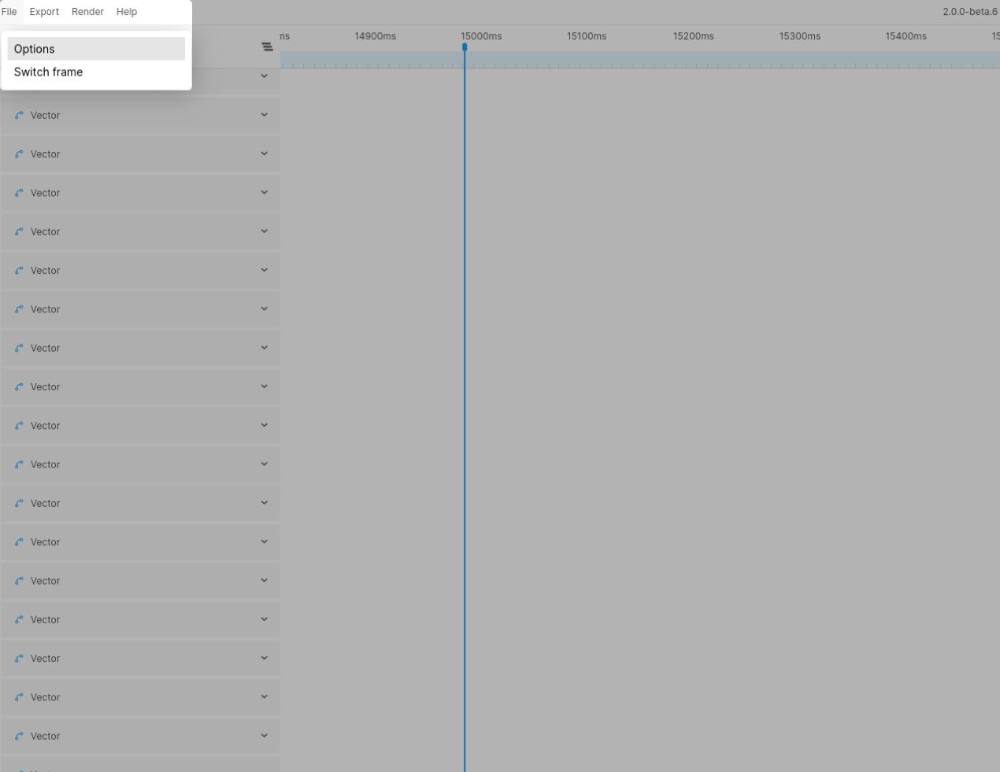

# Animation Options
The options menu can be found under the `File` menu item.

## Layer view mode
The layer view mode defines how you want to visualize the layers of your design. There are 2 options. These options are explained in the [Understanding Layers](../getting-started/understanding-layers) section.

## Reset mode
By default this option will be set to `Start`. This means your frame will reset to the start position upon closing Figmotion. This can also be set to `End`, in which case the frame will reset to the end point of your animation.
