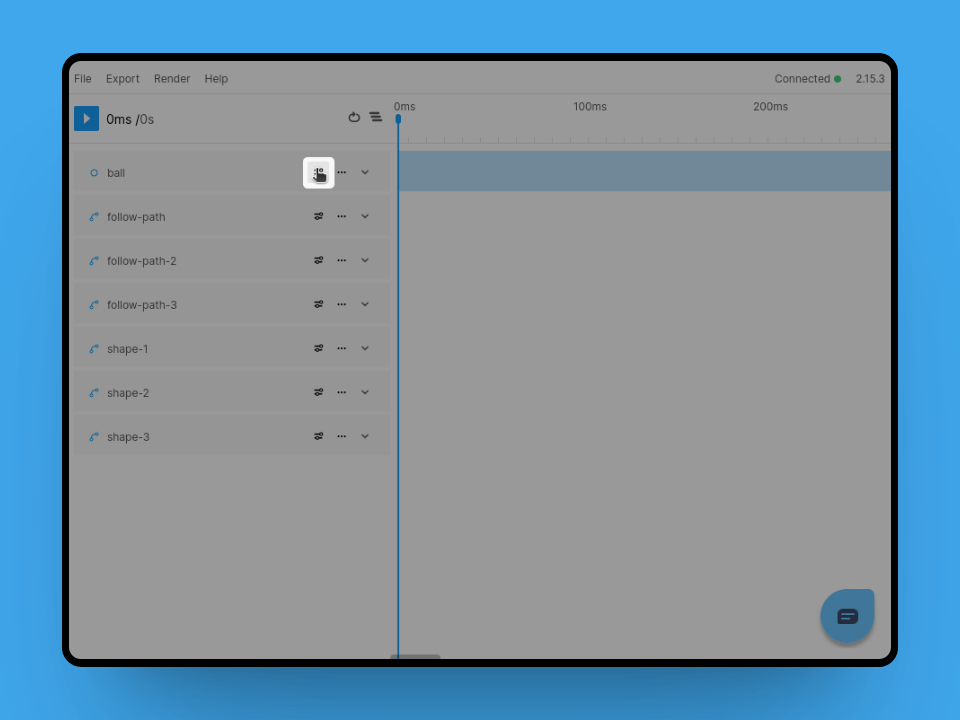
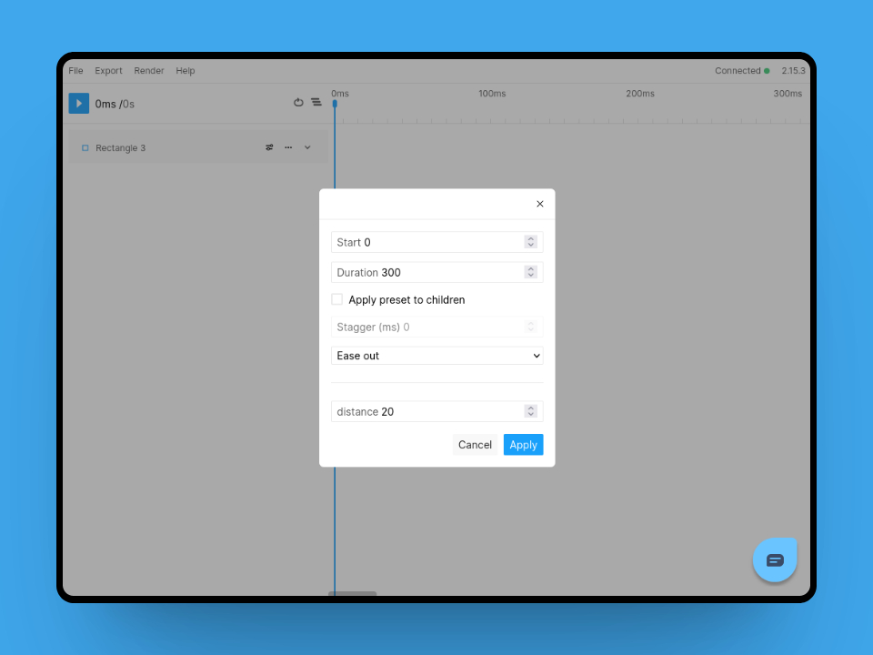
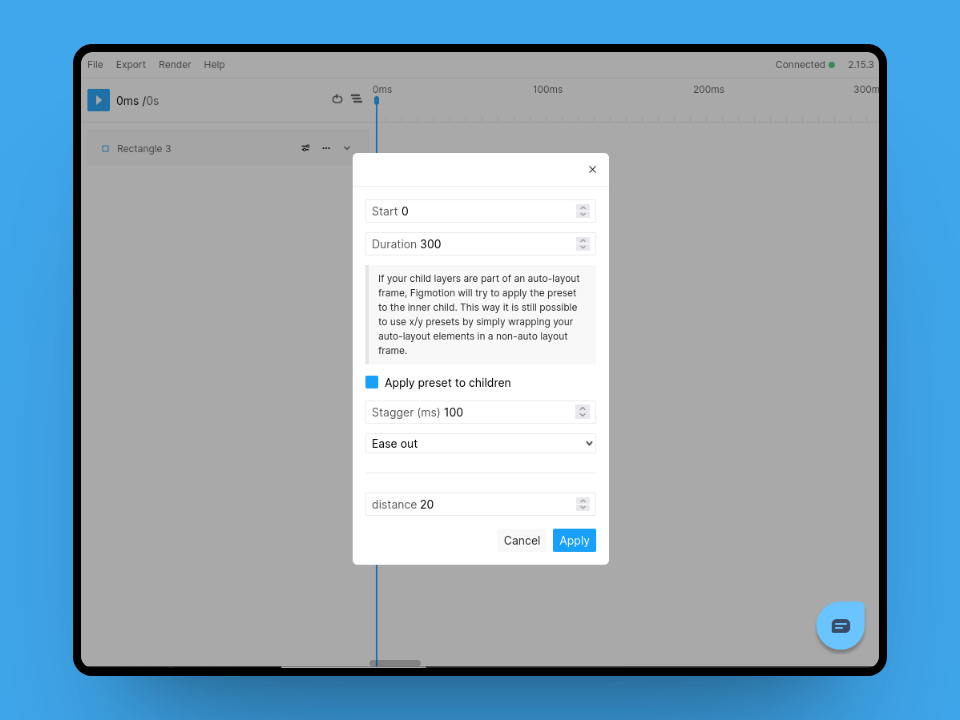

# Presets
If you want to quickly apply animations to a design you can make use of the presets functionality. The "Apply preset" button can be found on each layer.  

## Selecting and configuring a preset
Once you select a preset from the modal you will be able to configure it.
You will find basic options like when to start the preset as well as the duration.
Additionally you will also be able to adjust specific parameters of certain presets, such as the distance of the "fade in up" preset.

### Using the stagger children option
Figmotion can also apply the preset to the children of a frame instead of the frame itself.
This can be useful to animate in a list of items for example.

Once enabled you can adjust how the children should be staggered.

**Note** If the frame you are animating has auto layout enabled, the children won't be able to move. For this reason Figmotion will attempt to apply the preset to the inner child of the auto layout items. This way you can apply presets whilst keeping auto layout enabled.
