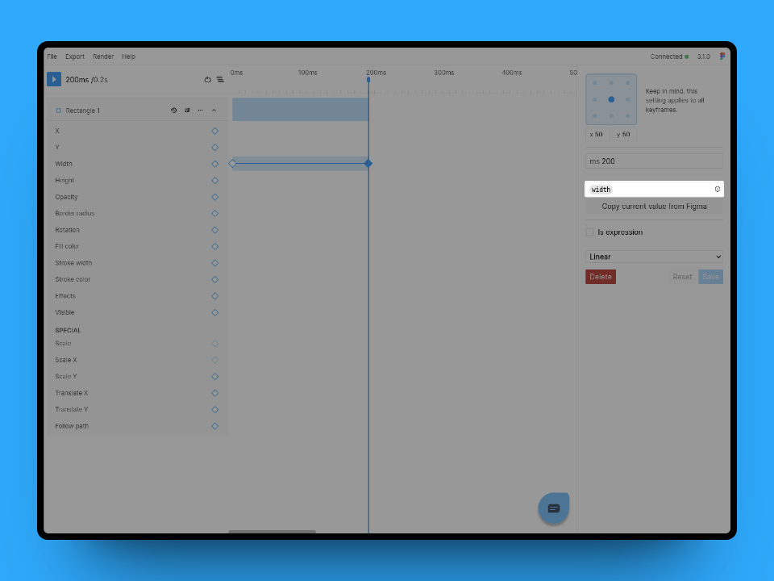

# The keyframe editor
When you click or select one or more keyframes you will see the keyframe editor open up on the right side of your screen. The editor gives you complete control over the keyframe and can show multiple keyframes at once.

## Changing the time
In the editor you can easily set an exact time for the keyframe by entering the desired value in `ms`.

## Changing the anchor point
By default your nodes will have their anchor point set in the middle of the object. You can change this by selecting a different anchor point in the keyframe editor. Keep in mind this setting is a node specific setting and can not be different across keyframes.  

**Note**  
*Keep in mind, changing the anchor point is a "global" change. It is not possible to have different anchor points for different parts of the animation.*

## Changing the value
Depending on the property you are animating you will see either a simple number input or a more specialized control such as a color picker. You can either enter the new value manually or you can change the node itself and use the `Copy current value from Figma` action to insert the new value automatically.

### Using variables
*Only available in standard*  

With the standard plan you get access to variables support in Figmotion. Variables are currently supported in most decimal fields and the text content field. You can use the cog icon inside the input to select a variable. Once selected, the variable name will show in the input. To remove the reference, you can double-click the "tag" and the variable reference will be replaced with it's resolved value.  

  

## Customizing the easing
Using the easing select box you can select between simple predefined easings or you can use a custom easing. When selecting custom you will be able to customize your easing using a timing curve. For more fine control over your easing curve you can always input the values manually in the input box.

