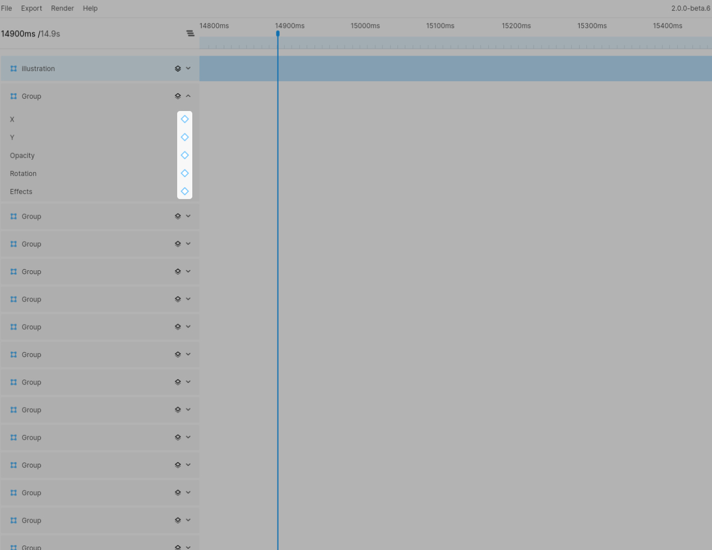

# Using keyframes

## Adding a keyframe
To add a keyframe for a specific property you simply click the keyframe icon in the layers sidebar. This will add a keyframe at the current time position with the current node property value. If you are not at 0ms this will also add a keyframe at 0ms as your animation will need a starting position.

## Moving keyframes
To move a keyframe you can simply drag it along the timeline. To help you position it correctly it will snap to your time handle. Whilst moving a keyframe a label with the current timecode will appear above the keyframe icon to make it easier to place the frame. To move a keyframe to an exact timecode you can also use the keyframe editor. (Read more about the [Keyframe Editor](./the-keyframe-editor))

**Tip** when dragging keyframes, they will snap to your current time handle position. You can hold `Shift` to disable snapping.

## Deleting keyframes
To delete one or more keyframes you need to select it first by clicking it. Once selected you can simply hit the `Delete` key to remove the keyframe.  

**Note**  
*The starting keyframe can not be removed without removing all other keyframes as well, since any animation needs to start with a keyframe.*
