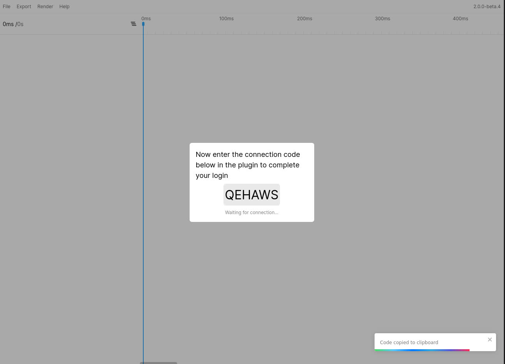

# Getting Started

## Opening the plugin
Figmotion works on frame level. This means you need to have a frame selected for the plugin to work. If you do not have a frame selected as you open the plugin you will be able to choose a "top level frame" (a frame that is a direct child of the current page) from the select box.

To open the plugin you will start by going to your Figma plugin menu and selecting the `Open Figmotion` item (grouped under the `Figmotion` plugin entry)  

## Connecting to the standalone app
Once the plugin launches you will see small plugin window with a one-time use code. Additionally, the plugin will also open the standalone app in your default browser.

Once both are open you can copy the code, enter it in the "one-time code" field and press `Enter` or hit `Submit`. This will connect the app to the plugin. To complete the handshake you will need to return to the plugin and press `Step 2`.

You should notice a new screen in the standalone app displaying another one-time code to complete the handhsake. You can copy this final code and enter it in the plugin window to complete the handshake.  

Once this is done you will see the plugin has completed the handshake.

Additionally, the standalone app will either display a frame selection dialog or it will simply display your animation timeline (if you had a frame pre-selected in Figma during the handshake).

