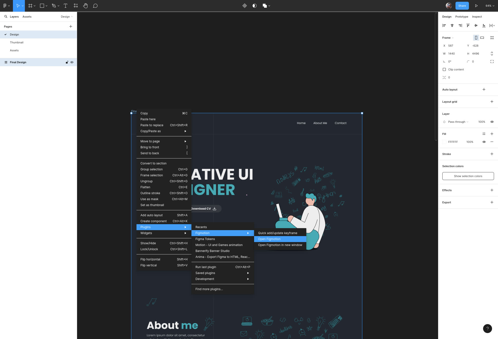
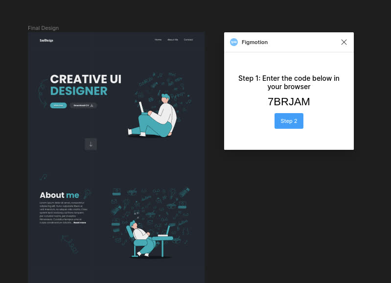
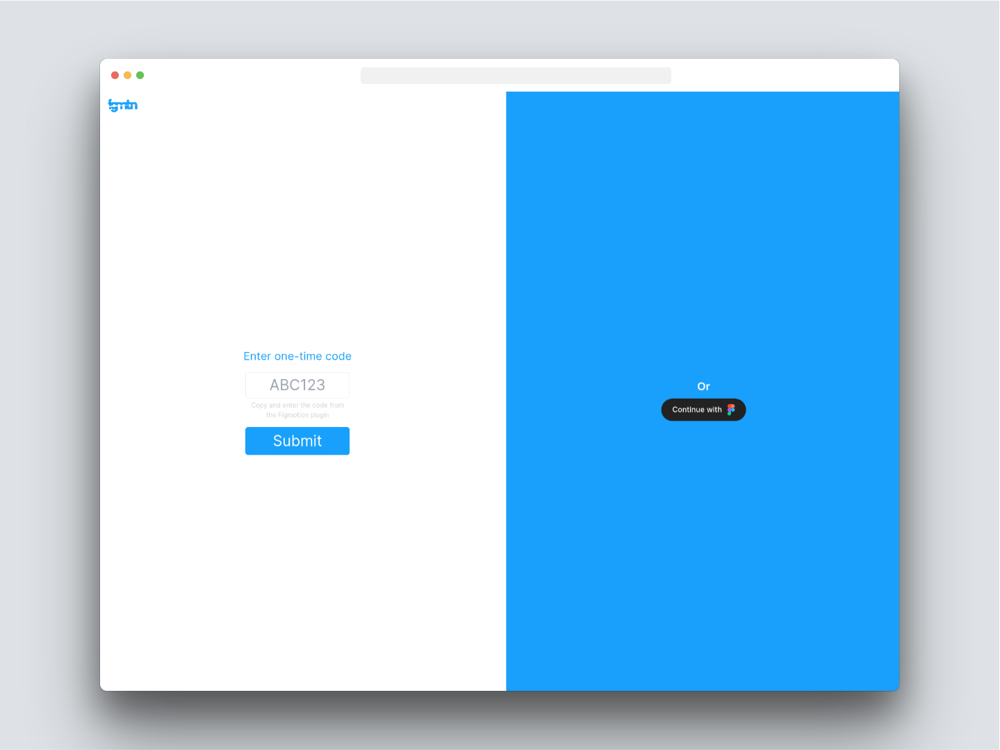
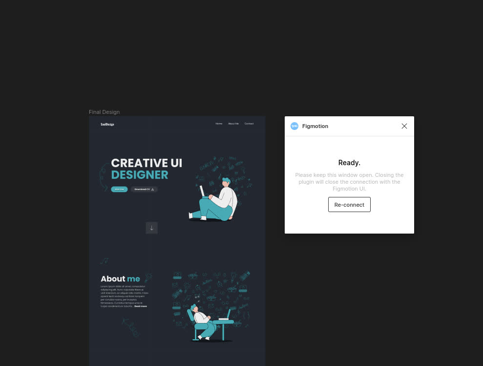
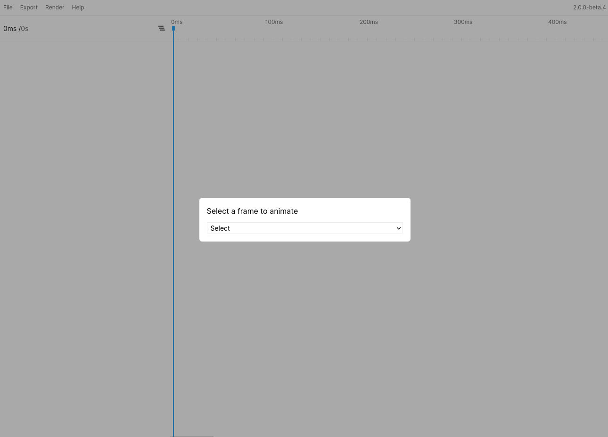
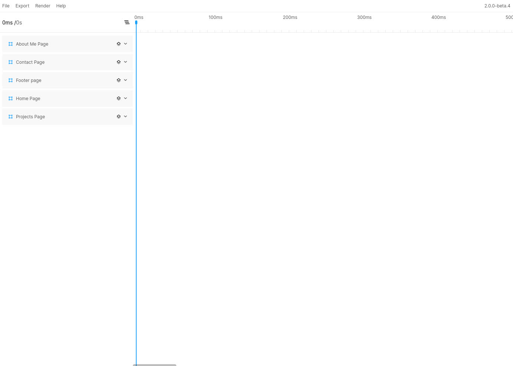

# Getting Started

## Opening the plugin
Figmotion works on frame level. This means you need to have a frame selected for the plugin to work. If you do not have a frame selected as you open the plugin you will be able to choose a "top level frame" (a frame that is a direct child of the current page) from the select box.

To open the plugin you will start by going to your Figma plugin menu and selecting the `Open Figmotion` item (grouped under the `Figmotion` plugin entry)  

## Connecting to the standalone app
Once the plugin launches you will see small plugin window with a one-time use code. Additionally, the plugin will also open the standalone app in your default browser.

Once both are open you can copy the code, enter it in the "one-time code" field and press `Enter` or hit `Submit`. Alternatively you can also login with your Figma account. This method will keep you logged in so you do not need to re-enter the one time code each time. This will connect the timeline app to the plugin.

Once this is done you will see the plugin has completed the handshake.

> **Note**  
> Although the distinct user interface might seem unfamiliar at first, it operates in the same way as the previous "in-app" experience. Additionally, it offers the advantage of placing the timeline anywhere on your screen, or even on a separate screen. Despite being a standalone app, it remains linked to your Figma window, just like the plugin.

Additionally, the standalone app will either display a frame selection dialog or it will simply display your animation timeline (if you had a frame pre-selected in Figma during the handshake).

> **Note**  
> When using the Frame selection dialog, it will display only the "top-level" frames. If you plan to animate a child frame, ensure that you select it during the connection setup.

