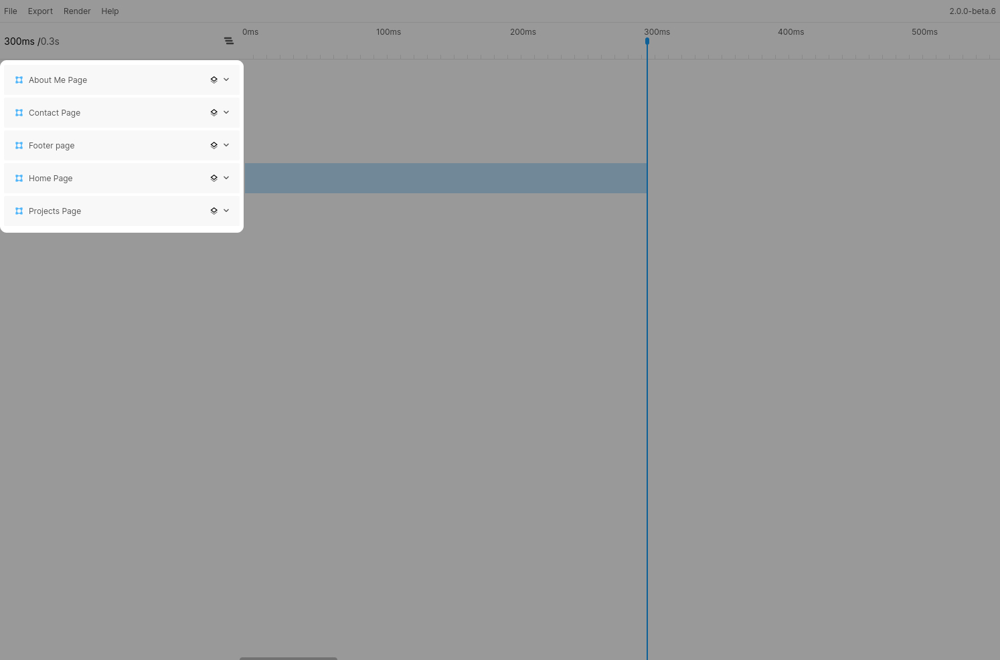
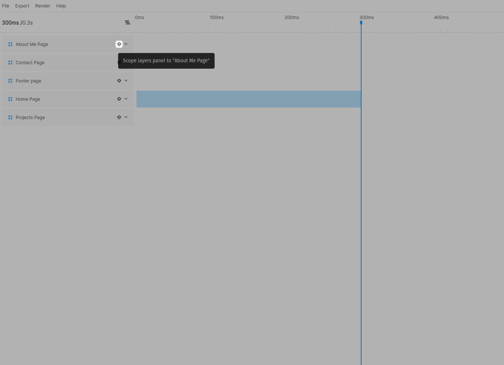
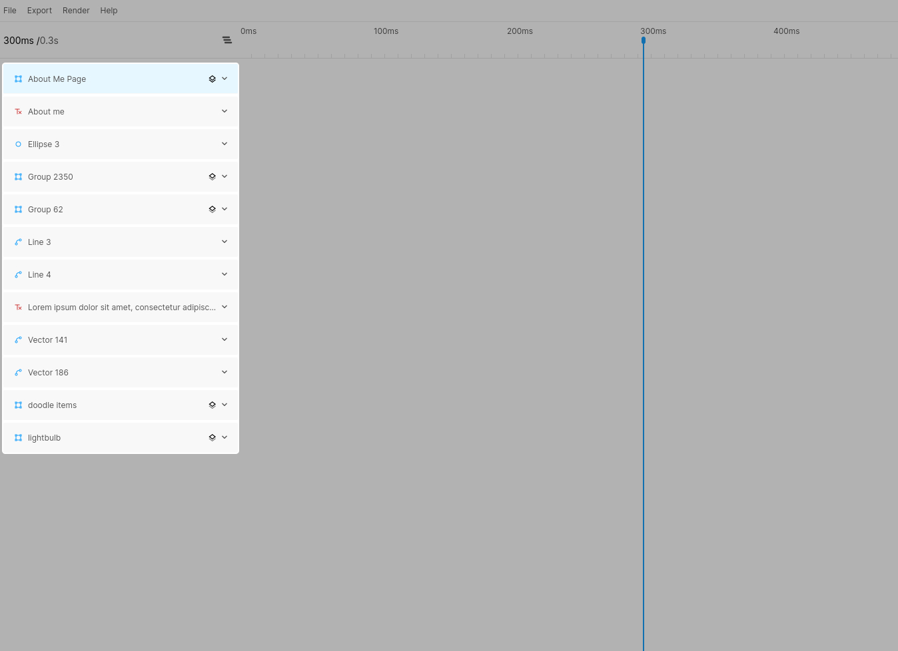
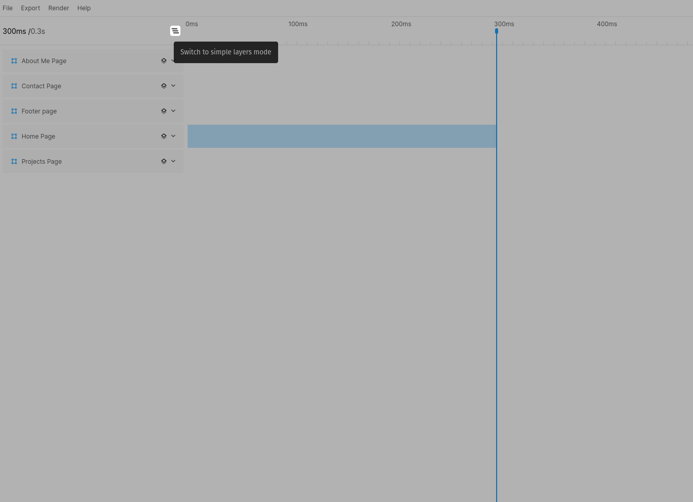
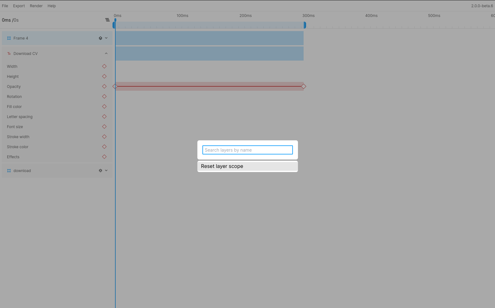

# Understanding layers

The left side of the window is dedicated to showing your layers. Here you will find the same layers you will find in Figma apart from groups and non-destructive vector operations (Join, Intersect, ...). The exclusion of these types was a conscious decision due to certain constraints within Figma.

## Switching between layer view modes
### Grouped mode
There are 2 options to view your layers. By default, Figmotion will be in "Grouped" mode where children are not shown by default. The children of a layer can be shown by "scoping" to the layer itself using the scope icon.

Once you are inside a layer scope, the layer itself and it's children will be displayed in the sidebar. The scoped layer will be highlighted and you can return to the previous view by clicking the "Scope" button again.

### List mode
It is also possible to switch to "list" or "simple" mode. Switching between modes can be done using the view switch button above the layers sidebar.
In list mode you will see all your layers (including all children) in a single list. Keep in mind this mode may casue performance issues if you have many layers.
You will also notice the scope button has disappeared, since this is not relevant in simple mode.

## Node highlighting
When hovering a layer in the plugin a red box will appear around the selected layer in Figma itself. This way you can identify the correct layer from inside the plugin.

## Quickly finding (or scoping to) a layer
You can use the `CMD/CTRL+P` shortcut to open the "Quick find" dialog. Using this dialog you can quickly search for a layer by name and scroll or scope to it. You can also use this menu to quickly reset the scope back to the root using the "Reset layer scope" option.

