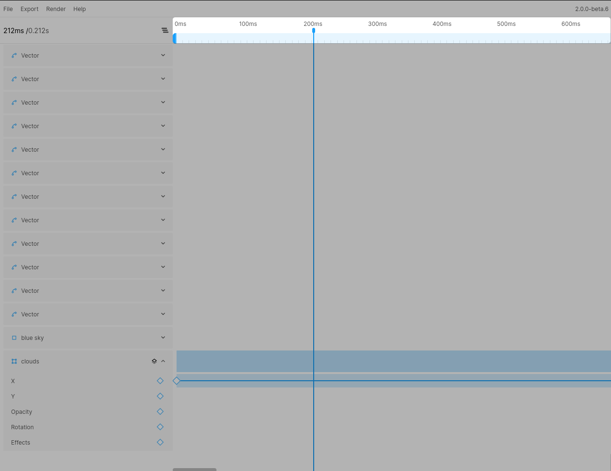
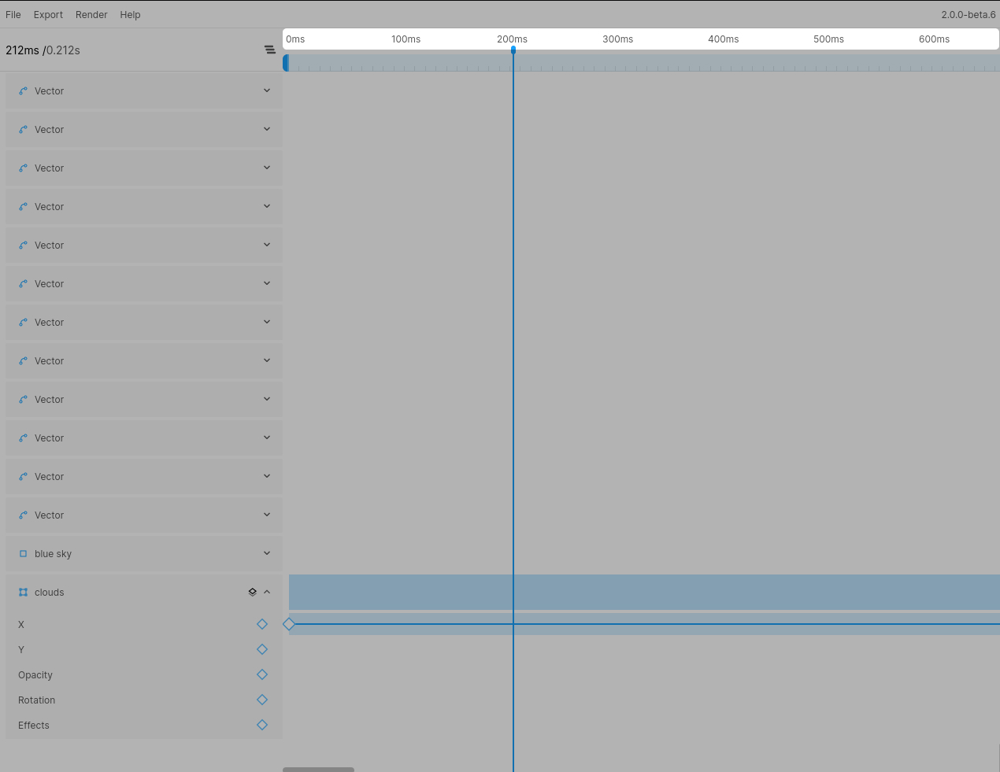
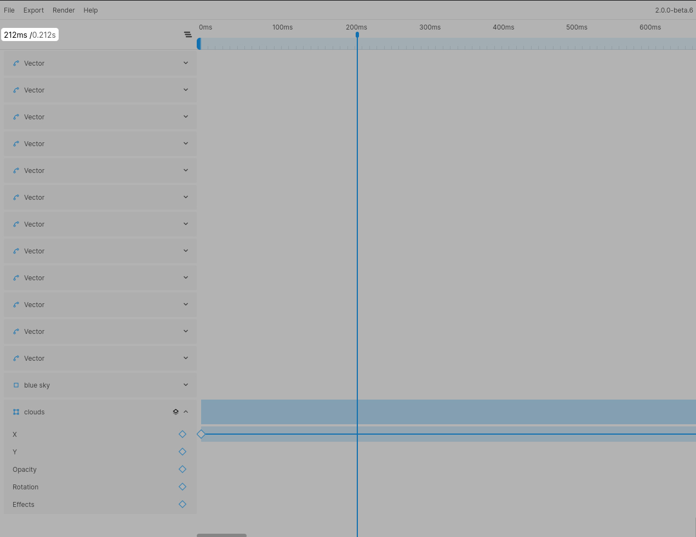
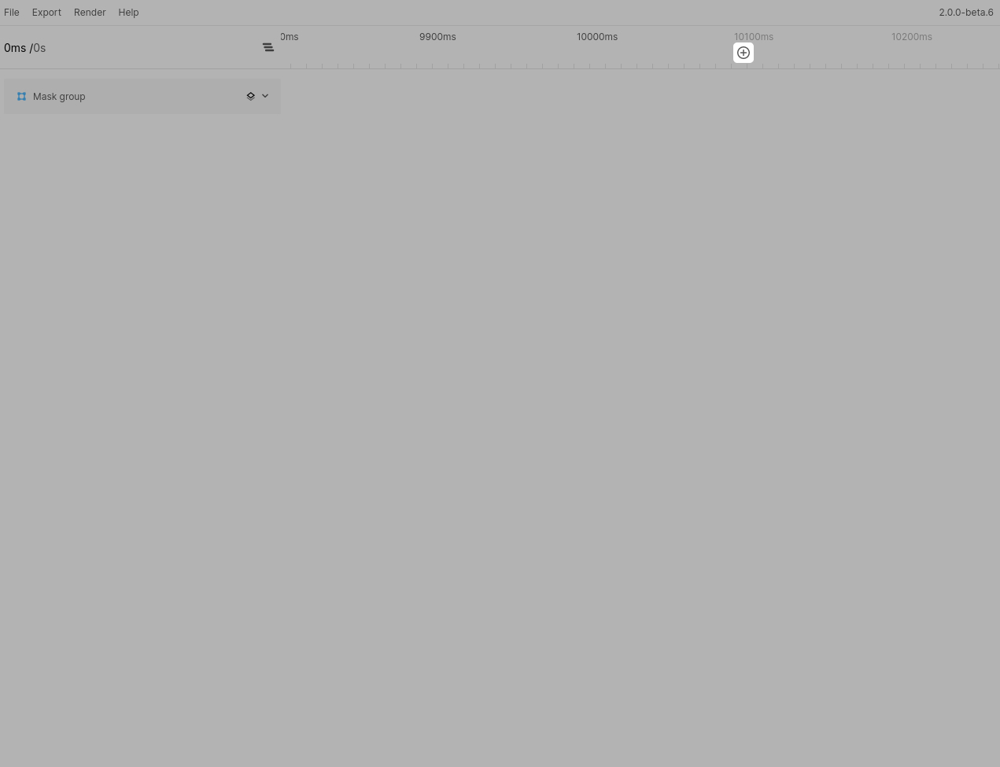

# Understanding the timeline

## Navigating the timeline

### Clicking and dragging the timeline header
You can click and drag anywhere in the timeline header to move the time handle.

### Jumping to a time header
You can also click any of the timeline titles to jump to that exact spot in the timeline.

### Jumping to an exact timecode
If you want to jump to an exact time, you can either click the timecode in the sidebar or use the shortcut `CMD/CTRL+J`.

**A note about scrolling in the timeline header**  
When scrolling whilst hovering over the timeline header the timehandle itself will not move, instead you will just move the visible section of the timeline without moving the handle. If you click/drag in the timeline header at any position after scrolling the behavior remains the same and the timehandle will jump to said position.

## Extending the timeline

By default the timeline will be 5s long. If you have an existing animation the timeline length will adjust to your last keyframe (in steps of 5s). So if your animation is 6s long, the available timeline will be 10s. You can extend the timeline length in steps of 5s by clicking the `+` button at the end of the timeline. This will extend the timeline by `5s`.

