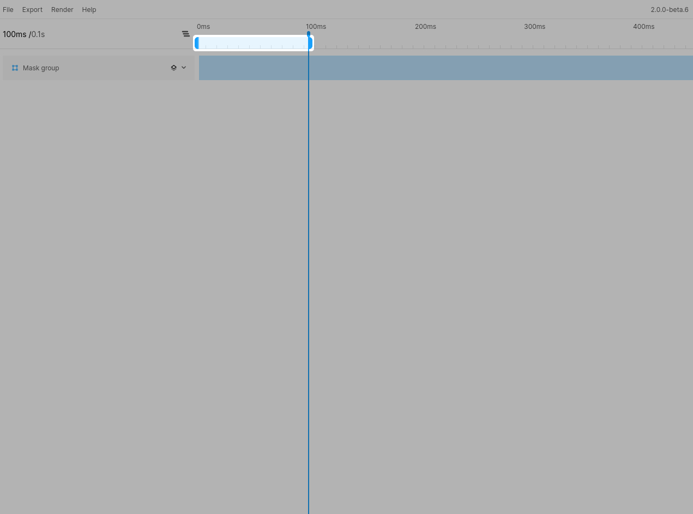

# Using in/out points
One important aspect of the animation timeline to understand is the in/out points. These determine your current animation playback start and end as well as the render start and end position. By default Figmotion will always render and playback the full animation and you won't see the input/output point handle. The bar will appear once you set an input or output point (read below).

## Manually setting the in/out points
To set an input or output point you can use the shortcuts `I` and `O` respectively (no `CTRL/CMD`).
If you have not set any in/out points yet, Figmotion will automatically add the opposite point.
This means if you set an input point, the output point will automatically be set to the end of the animation.
When you set an output point, the input point will automatically be set to `0ms`.

Once you have in/out points set you can also use the the handles to drag them to the desired place.

## Resetting the in/out points
To reset either your in or out point you can use the shortcuts `CTRL/CMD+K` and `CTRL/CMD+M` respectively. The in point will always be reset to `0ms` whereas the out point will always be reset to the last keyframe of your animation (or to the end of the timeline if there are no keyframes).

You can also use the shortcut `CTRL/CMD+K` to remove both input/output points. This returns Figmotion to it's initial state.
