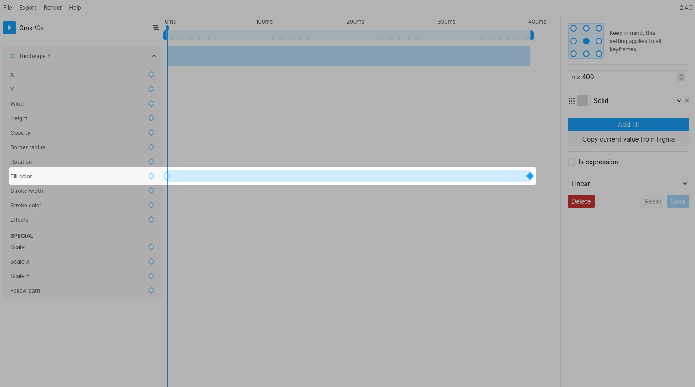

# Fill color
  

### Notes
> Figmotion will ignore image fills, however the animation engine will preserve your image fills when animating so they will be preserved within Figma.

> For correct animation you will need to make sure you have an equal amount of fills for each keyframe so they can transition correctly.

> It is not possible to adjust the position of the gradient within Figmotion. If you want to animate or update the positioning you can use the "Copy current value from Figma" functionality.
