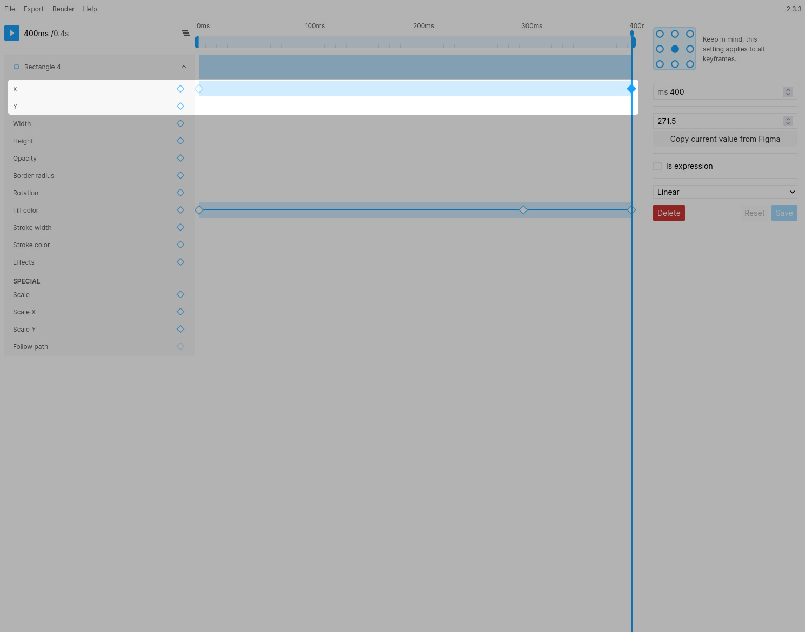

# Position (x/y)

### Notes
> The values for `x` and `y` within Figmotion will not match the values you see within Figma itself. This is because Figma positions layers based on the top-left corner, whereas (by default) Figmotion will position layers by according to their center point. This can be adjusted by changing the anchor point of your layer (this also affects other properties such as rotation).

> Lottie combines x and y into a single position property. This means the easing will be consolidated.