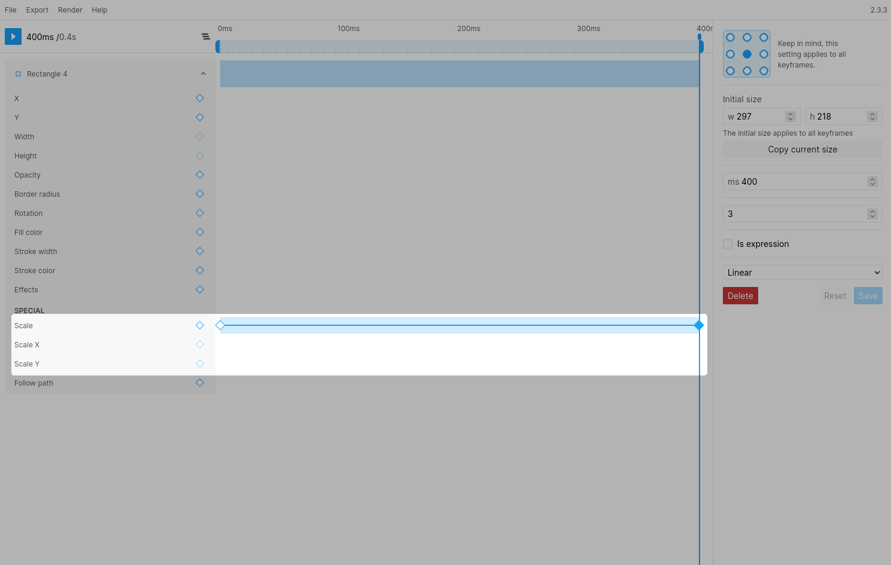

# Scale (Scale, scale X and scale Y)

You can use the scale properties to animate the width and height based on a relative scale value (0 - 1).

### Notes
> The initial size needs to be specified for these properties to work.  
