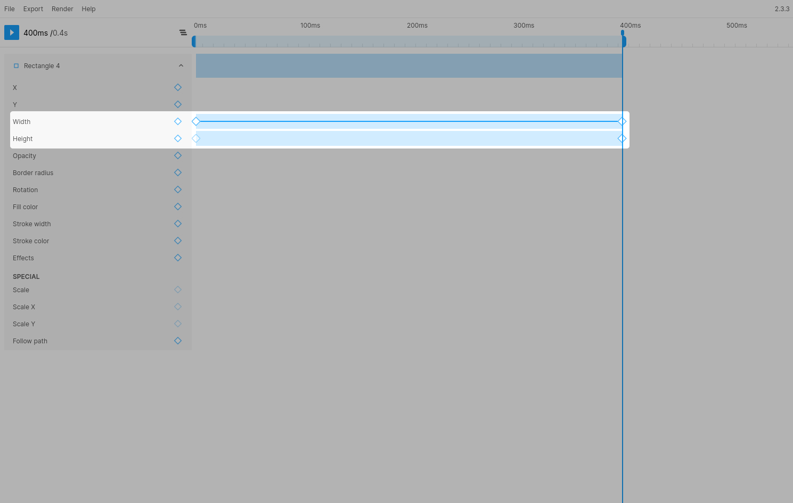

# Size (width/height)

### Notes
> Anchor point rules also apply to width and height. This means the layer will scale from the center, if the anchor point is set to it's default value (middle-center). If you change the anchor point to top-left, the layer will scale from the top-left corner.

> The values for width and height have to be absolute. If you want to animate the size based on relative values, you can use the [Scale properties](./scale)

> Lottie combines width and height into a single size property. This means the easing will be consolidated.